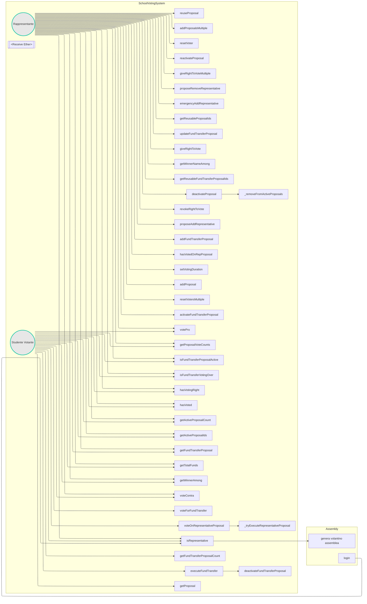

```mermaid
---
config:
  layout: elk
---
flowchart LR
 subgraph SchoolVotingSystem["SchoolVotingSystem"]
    direction TB
        SchoolVotingSystem.onlyRepresentative(("Rappresentante"))
        SchoolVotingSystem.onlyVoter(("Studente Votante"))
        SchoolVotingSystem.ReceiveEther[["&lt;Receive Ether&gt;"]]
        SchoolVotingSystem.setVotingDuration["setVotingDuration"]
        SchoolVotingSystem.addFundTransferProposal["addFundTransferProposal"]
        SchoolVotingSystem.updateFundTransferProposal["updateFundTransferProposal"]
        SchoolVotingSystem.activateFundTransferProposal["activateFundTransferProposal"]
        SchoolVotingSystem.deactivateFundTransferProposal["deactivateFundTransferProposal"]
        SchoolVotingSystem.voteForFundTransfer["voteForFundTransfer"]
        SchoolVotingSystem.executeFundTransfer["executeFundTransfer"]
        SchoolVotingSystem.proposeAddRepresentative["proposeAddRepresentative"]
        SchoolVotingSystem.proposeRemoveRepresentative["proposeRemoveRepresentative"]
        SchoolVotingSystem.emergencyAddRepresentative["emergencyAddRepresentative"]
        SchoolVotingSystem.voteOnRepresentativeProposal["voteOnRepresentativeProposal"]
        SchoolVotingSystem._tryExecuteRepresentativeProposal["_tryExecuteRepresentativeProposal"]
        SchoolVotingSystem.giveRightToVote["giveRightToVote"]
        SchoolVotingSystem.revokeRightToVote["revokeRightToVote"]
        SchoolVotingSystem.giveRightToVoteMultiple["giveRightToVoteMultiple"]
        SchoolVotingSystem.addProposal["addProposal"]
        SchoolVotingSystem.addProposalsMultiple["addProposalsMultiple"]
        SchoolVotingSystem.deactivateProposal["deactivateProposal"]
        SchoolVotingSystem.reactivateProposal["reactivateProposal"]
        SchoolVotingSystem.reuseProposal["reuseProposal"]
        SchoolVotingSystem._removeFromActiveProposals["_removeFromActiveProposals"]
        SchoolVotingSystem.votePro["votePro"]
        SchoolVotingSystem.voteContra["voteContra"]
        SchoolVotingSystem.resetVoter["resetVoter"]
        SchoolVotingSystem.resetVotersMultiple["resetVotersMultiple"]
        SchoolVotingSystem.getProposalVoteCounts["getProposalVoteCounts"]
        SchoolVotingSystem.getProposal["getProposal"]
        SchoolVotingSystem.getWinnerAmong["getWinnerAmong"]
        SchoolVotingSystem.getWinnerNameAmong["getWinnerNameAmong"]
        SchoolVotingSystem.getActiveProposalIds["getActiveProposalIds"]
        SchoolVotingSystem.getActiveProposalCount["getActiveProposalCount"]
        SchoolVotingSystem.isRepresentative["isRepresentative"]
        SchoolVotingSystem.hasVotingRight["hasVotingRight"]
        SchoolVotingSystem.hasVoted["hasVoted"]
        SchoolVotingSystem.hasVotedOnRepProposal["hasVotedOnRepProposal"]
        SchoolVotingSystem.getReusableProposalIds["getReusableProposalIds"]
        SchoolVotingSystem.getFundTransferProposal["getFundTransferProposal"]
        SchoolVotingSystem.getTotalFunds["getTotalFunds"]
        SchoolVotingSystem.isFundTransferVotingOver["isFundTransferVotingOver"]
        SchoolVotingSystem.isFundTransferProposalActive["isFundTransferProposalActive"]
        SchoolVotingSystem.getFundTransferProposalCount["getFundTransferProposalCount"]
        SchoolVotingSystem.getReusableFundTransferProposalIds["getReusableFundTransferProposalIds"]
  end
 subgraph assembly["Assembly"]
    direction TB
        Assembly.createAssembly["genera volantino assemblea"]
        Assembly.login["login"]
  end
    SchoolVotingSystem.voteOnRepresentativeProposal --> SchoolVotingSystem._tryExecuteRepresentativeProposal
    SchoolVotingSystem.deactivateProposal --> SchoolVotingSystem._removeFromActiveProposals
    SchoolVotingSystem.onlyRepresentative --> SchoolVotingSystem.addProposal & SchoolVotingSystem.addProposalsMultiple & SchoolVotingSystem.reuseProposal & SchoolVotingSystem.deactivateProposal & SchoolVotingSystem.setVotingDuration & SchoolVotingSystem.updateFundTransferProposal & SchoolVotingSystem.addFundTransferProposal & SchoolVotingSystem.activateFundTransferProposal & SchoolVotingSystem.votePro & SchoolVotingSystem.voteContra & SchoolVotingSystem.proposeAddRepresentative & SchoolVotingSystem.giveRightToVoteMultiple & SchoolVotingSystem.getTotalFunds & SchoolVotingSystem.resetVoter & SchoolVotingSystem.hasVoted & SchoolVotingSystem.revokeRightToVote & SchoolVotingSystem.isRepresentative & SchoolVotingSystem.getReusableFundTransferProposalIds & SchoolVotingSystem.getActiveProposalCount & SchoolVotingSystem.hasVotedOnRepProposal & SchoolVotingSystem.getFundTransferProposal & SchoolVotingSystem.hasVotingRight & SchoolVotingSystem.isFundTransferVotingOver & SchoolVotingSystem.getActiveProposalIds & SchoolVotingSystem.getProposalVoteCounts & SchoolVotingSystem.getWinnerAmong & SchoolVotingSystem.giveRightToVote & SchoolVotingSystem.reactivateProposal & SchoolVotingSystem.resetVotersMultiple & SchoolVotingSystem.getWinnerNameAmong & SchoolVotingSystem.getReusableProposalIds & SchoolVotingSystem.emergencyAddRepresentative & SchoolVotingSystem.isFundTransferProposalActive & SchoolVotingSystem.proposeRemoveRepresentative
    SchoolVotingSystem.onlyVoter --> SchoolVotingSystem.voteOnRepresentativeProposal & SchoolVotingSystem.votePro & SchoolVotingSystem.voteContra & SchoolVotingSystem.getProposalVoteCounts & SchoolVotingSystem.getTotalFunds & SchoolVotingSystem.executeFundTransfer & SchoolVotingSystem.voteForFundTransfer & SchoolVotingSystem.getProposal & SchoolVotingSystem.hasVoted & SchoolVotingSystem.getWinnerAmong & SchoolVotingSystem.isRepresentative & SchoolVotingSystem.getActiveProposalCount & SchoolVotingSystem.getFundTransferProposal & SchoolVotingSystem.hasVotingRight & SchoolVotingSystem.isFundTransferVotingOver & SchoolVotingSystem.getActiveProposalIds & SchoolVotingSystem.isFundTransferProposalActive & SchoolVotingSystem.getFundTransferProposalCount
    SchoolVotingSystem.executeFundTransfer --> SchoolVotingSystem.deactivateFundTransferProposal
    Assembly.login --> SchoolVotingSystem.isRepresentative
    SchoolVotingSystem.isRepresentative --> Assembly.createAssembly

    style SchoolVotingSystem.onlyRepresentative fill:#E7E7E7,stroke:#1bc6a6,stroke-width:3px
    style SchoolVotingSystem.onlyVoter fill:#E7E7E7,stroke:#1bc6a6,stroke-width:3px
```

